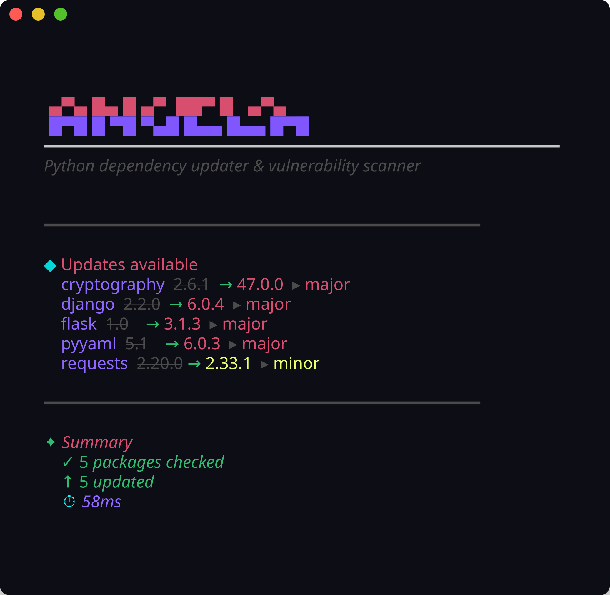

<!-- ©Artefhack | 2026 -->
<!-- DEMO.md -->

<div align="center">

```ruby
██╗   ██╗ ██╗   ██╗ ██╗      ███╗   ██╗ ███████╗  ██████╗  ██████╗   ██████╗ ███████╗
██║   ██║ ██║   ██║ ██║      ████╗  ██║ ██╔════╝ ██╔═══██╗ ██╔══██╗ ██╔════╝ ██╔════╝
██║   ██║ ██║   ██║ ██║      ██╔██╗ ██║ █████╗   ██║   ██║ ██████╔╝ ██║  ███╗ █████╗
╚██╗ ██╔╝ ██║   ██║ ██║      ██║╚██╗██║ ██╔══╝   ██║   ██║ ██╔══██╗ ██║   ██║ ██╔══╝
 ╚████╔╝  ╚██████╔╝ ███████╗ ██║ ╚████║ ██║      ╚██████╔╝ ██║  ██║ ╚██████╔╝ ███████╗
  ╚═══╝    ╚═════╝  ╚══════╝ ╚═╝  ╚═══╝ ╚═╝       ╚═════╝  ╚═╝  ╚═╝  ╚═════╝  ╚══════╝
```

**Demo & Preview**

<br>

<a href="https://pkg.go.dev/github.com/Kiliankm19/vulnforge">
  
</a>

<br>

```ruby
go install github.com/Kiliankm19/vulnforge/cmd/vulnforge@latest
```

<br>

[Update Check](#update-check) · [Vulnerability Scan](#vulnerability-scan)

</div>

---

### Update Check

Parallel PyPI queries with PEP 440 version parsing, surfacing major and minor upgrades across pyproject.toml dependencies



---

### Vulnerability Scan

OSV.dev integration grouping CVEs by package and severity with first-fixed version per advisory


